# MB PHOTOGRAPHY
MB Photography is a website for people looking for photography service where their special moments will be captured through professional photography skills. 

This website showcases the photographer's skills through sample photos and targets people from all walks of life who need their special moments captured whether it be a wedding, birthday celebration, portrait or travel photography. 

The website also allows prospective clients to get in touch with the service provider by means of filling in a form. You can access live site [here](https://mikel072889.github.io/mb-photography-project1/)

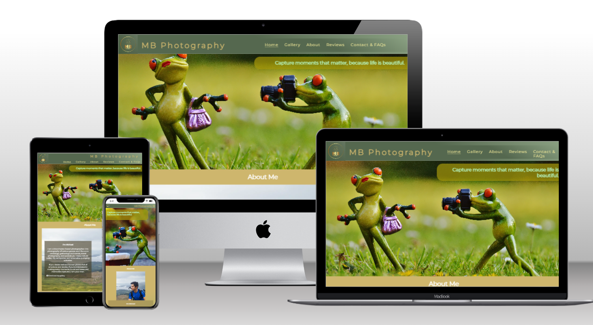

## Features
### Navigation 
* The navigation bar is located at the top corner of the page. It includes the business logo on the top left corner which links to Home page. On the right side, the navigation bar contains the Home, Gallery, About, Reviews, Contact + FAQs sections. The navbar is set to be responsive to all devices.
* Home, Reviews, and About sections link to different sections of the landing page, however, Reviews and About sections also have their dedicated page for more information that might be useful to prospective customers.
* The Gallery and Contacts + FAQs sections link to separate pages.
* The navigation bar is simple and is designed to be less overwhelming to users, hence facilitating accessibility.

### The Main Sections
#### The Landing Page
* The landing page includes a background hero image, a photo professionally taken by the photographer to give a taste of his talent to users. The hero image featured is designed to captivate future clients' attention and to develop a degree curiosity making them want to navigate throught the website more. 
* Included here is the website's main slogan "Capture moments that matter, because life is beautiful!" giving the users a hint of what the page is all about.
* The landing page shows the About and Reviews section, both containing links to their own dedicated page making more information available for users.

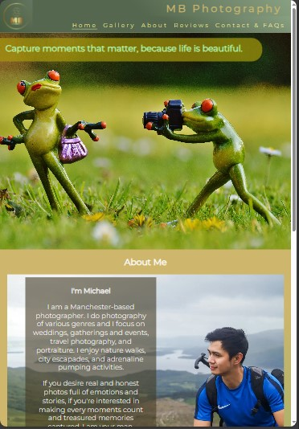
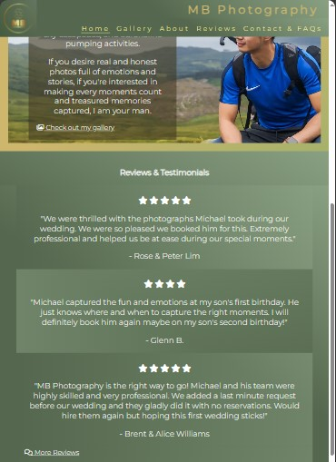

#### The Gallery Section
* The Gallery section contains the photographer's sample works from various photography disciplines. This is to draw attention and establish emotional connection with the users to make them arrive into a decision of availing the service.
* Each photography disclipine has their own dedicated section and slogan. This facilitates filtered accessibility for users and will make it easier for them to focus on a specific genre of interest.

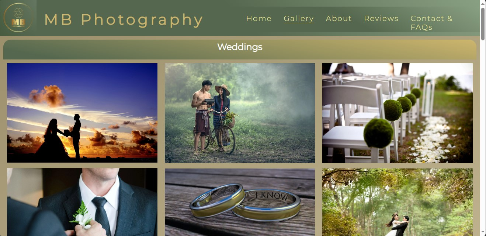
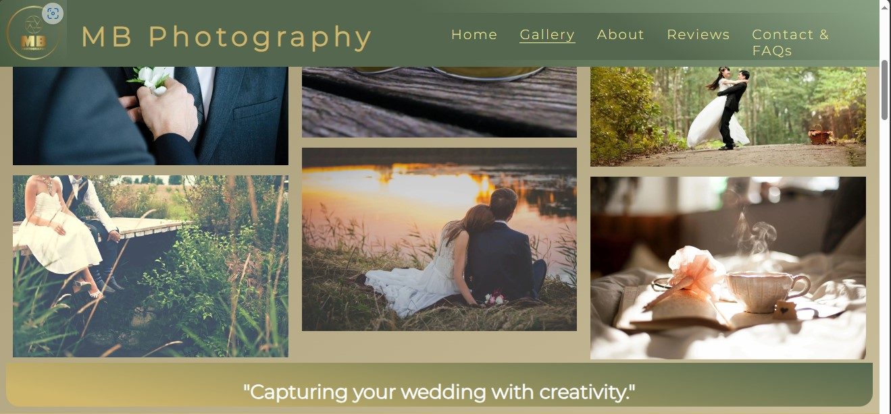

#### The About Section
* Located within the Homepage, this section provides details about the photographer. It includes the photographer's photo to facilitate rapport building and creating good first impressions.

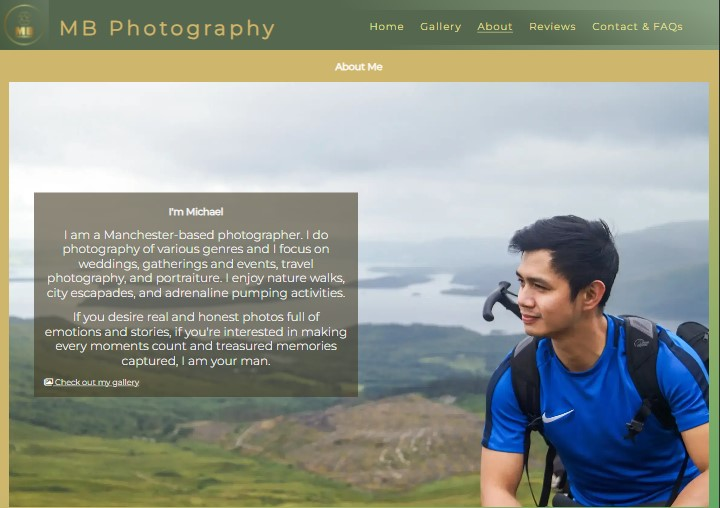

* After knowing someone, this is a perfect opportunity to know more about them, hence, this section features a link to the gallery page to facilitate continuous flow of interest from the client.

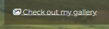

#### The Reviews Section
* The Reviews section contains the reviews and testimonials made by previous clients recapping their experience with the service. This is designed to draw positive impression and reactions from the users. This can also serve as convincing factor for the users.

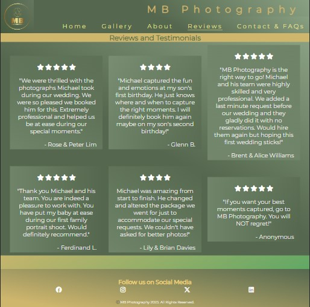

* The Reviews section is also readily available on the landing page. In there, it features a link to the dedicated reviews page where more reviews can be found. 

#### The Contact + FAQs Section
* This section provides the opportunity for the user to communicate any queries or inquiries with the service provider through the use of a form that requires mandatory inputs. The user can also pre-select their photography genre of choice or requirement and can also send a direct message using the message box provided.
The form features a Reset button and Send button. 
* The FAQs subsection is on the right side of the form. This can save the user's time and will deter repetitive questions and can therefore utilise the message box better for other more important queries.

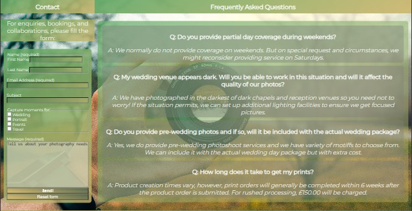

#### Received Form Page
* This page appears on successful submission of the contact form. It provides reassurance to future clients and also provides contact details for urgent inquiries. 

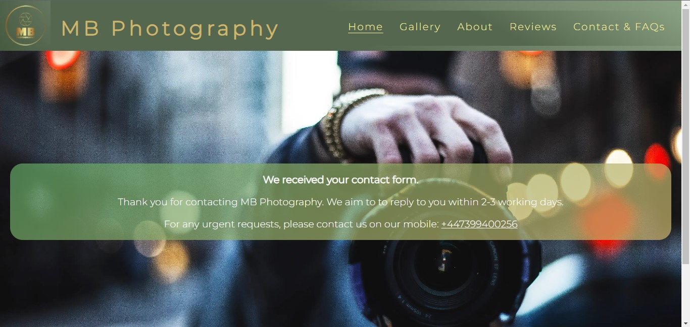

### The Footer
* The footer is constantly present on all the pages. This features links to MB Photography's social media accounts. The footer also includes the photographer's contact details such as email address and mobile number.
* MB Photography contains original works of authorship and editing, hence, a copyright disclaimer is included at the bottom most part of the footer to preserve the originality of the photographer's works.  

### Favicon

* The website features a favicon with a round golden image signifying the lens of a camera. This can facilitate easier navigation for users when they have multiple tabs open in one window.

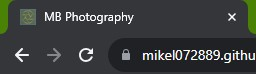

### Existing Features
* Website responsive design
* Contact form with mandatory inputs and received form page
* Four photography genres included

### Future Feature Enhancements
* Make landing page hero image automatically change so it features more photographs
* Apply scroll feature to the gallery where clients can scroll across multiple photos at ease
* Add a section where previous clients can add reviews and be posted in the website in real time
* Add more photography genres

## Design
### Wireframes
* Landing Page
 
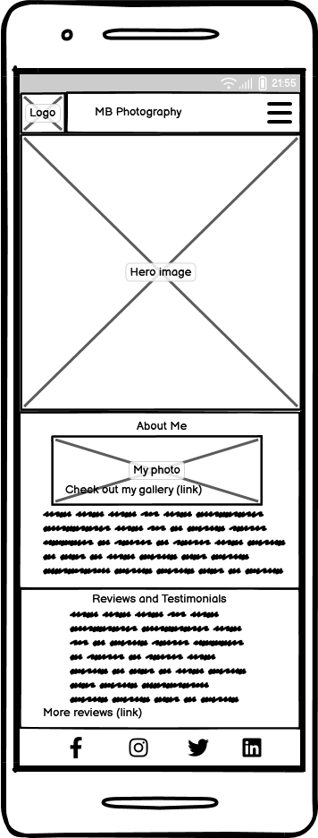
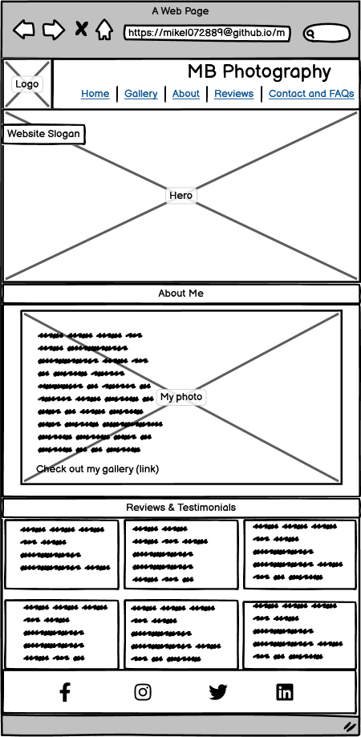

## Testing
[comment]: <> (awaiting project's near completion)

## Bugs
[comment]: <> (awaiting project's near completion)

## Validator Testing 
[comment]: <> (awaiting project's near completion)

## Deployment
[comment]: <> (awaiting project's near completion)

## Credits
### Gallery Content/Media
[comment]: <> (awaiting project's near completion)
