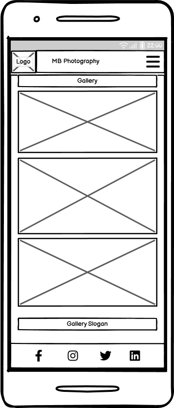
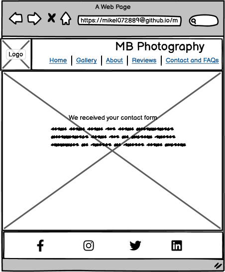

# MB PHOTOGRAPHY
MB Photography is a website for people looking for photography service where their special moments will be captured through professional photography skills. 

This website showcases the photographer's skills through sample photos and targets people from all walks of life who need their special moments captured whether it be a wedding, birthday celebration, portrait or travel photography. 

The website also allows prospective clients to get in touch with the service provider by means of filling in a form. You can access live site [here](https://mikel072889.github.io/mb-photography-project1/)


## Features
### Navigation 
* The navigation bar is located at the top corner of the page. It includes the business logo on the top left corner which links to Home page. On the right side, the navigation bar contains the Home, Gallery, About, Reviews, Contact + FAQs sections. The navbar is set to be responsive to all devices.
* Home, Reviews, and About sections link to different sections of the landing page, however, Reviews and About sections also have their dedicated page for more information that might be useful to prospective customers.
* The Gallery and Contacts + FAQs sections link to separate pages.
* The navigation bar is simple and is designed to be less overwhelming to users, hence facilitating accessibility.


### The Main Sections
#### The Landing Page
* The landing page includes a background hero image, a photo professionally taken by the photographer to give a taste of his talent to users. The hero image featured is designed to captivate future clients' attention and to develop a degree of curiosity making them want to navigate through the website more. 
* Included here is the website's main slogan "Capture moments that matter, because life is beautiful." giving the users a hint of what the page is all about.
* The landing page shows the About and Reviews section, both containing links to their own dedicated page making more information available for users.


#### The Gallery Page
* The Gallery page contains the photographer's sample works from various photography disciplines. This is to draw attention and establish emotional connection with the users to make them arrive into a decision of availing the service.
* Each photography disclipine has their own dedicated section and slogan. This facilitates filtered accessibility for users and will make it easier for them to focus on a specific genre of interest.


#### The About Section and Page
* Located within the homepage, this section provides details about the photographer. It includes the photographer's photo to facilitate rapport building and creating good first impressions.

* This section also has its own dedicated page which can be navigated to using the navigation bar.


* After reading about the photographer, this is a perfect opportunity to know more about the offered services, hence, this section features a link to the gallery page to facilitate continuous flow of interest from the client.


#### The Reviews Section and Page
* The Reviews page contains the reviews and testimonials made by previous clients recapping their experience with the service. This is designed to draw positive impression and reactions from the users. This can also serve as convincing factor for the users.


* The Reviews section is also readily available on the landing page. In there, it features a link to the dedicated reviews page where more reviews can be found. 


#### The Contact + FAQs Section
* This section provides the opportunity for the user to communicate any queries or inquiries with the service provider through the use of a form that requires mandatory inputs. The user can also pre-select their photography genre of choice or requirement and can also send a direct message using the message box provided.
The form features a Reset button and Send button providing convenience to users. 
* The FAQs subsection is on the right side of the form. This can save the user's time and will deter repetitive questions and can therefore allow the users to utilise the message box better for other more important queries.


#### Received Form Page
* This page appears on successful submission of the contact form. It reassures future clients and provides contact details for urgent inquiries. 


### The Footer
* The footer is constantly present on all the pages. This features links to MB Photography's various social media accounts. 
* The footer also includes the photographer's contact details such as email address and mobile number. They are clickable links that will open phone or email windows for user. This allows users to directly contact MB Photography.
* MB Photography contains original works of authorship and editing, hence, a copyright disclaimer is included at the bottom most part of the footer to preserve the originality of the photographer's works.  


### Favicon

* The website features a favicon with a round golden image signifying the lens of a camera. This can facilitate easier navigation for users when they have multiple tabs open in one window.


### Existing Features
* Website responsive design
* Contact form with mandatory inputs and received form page
* Four photography genres included

### Future Feature Enhancements
* Add animation on scroll feature to the landing page to showcase more photos
* Apply scroll feature to the gallery where clients can scroll across multiple photos at ease
* Add a section where previous clients can add reviews and be posted in the website in real time
* Add more photography genres

## Design
### Wireframes
* Landing Page
<br>


* Gallery Page
<br>




* About Page
<br>


* Reviews Page
<br>


* Contact and FAQs Page
<br>


* Received Form Page
<br>




## Technologies
* HTML 
    * HTML was utilised in developing the basic structure of the website.
* CSS
    * Styles were applied using external css file.
* Codeanywhere IDE
    * Codeanywhere IDE was used at the initial phase of constructing the website.
* Visual Studio Code IDE
    * VS Code IDE was used midway through the project and until the finishing touches.
* Github
    * Source code is hosted and deployed using github.
* Git
    * Used to add, commit, and push codes during the development process.
* Balsamiq Wireframes
    * Used in creating a blueprint or draft of the project on the early phase of development.
* Convertio.co 
    * https://convertio.co/jpg-webp/ was used in converting image files to webp format.
* Tinypng.com 
    * https://tinypng.com/ was used to compress image files to improve website performance.
* Paint - Windows 10
    * Used to reduce image size maintaing aspect ratio.
* Favicon.io 
    * Favicon was created from https://favicon.io/favicon-converter/.
* Google font
    * Font used in the website was sourced from https://fonts.google.com.
* Logo Generator
    * https://looka.com was used in creating a logo for MB Photography.
* Chrome DevTools
    * Used in inspecting, editing, and debugging the website code during its development phase.

## Testing
### Responsiveness
Responsiveness was tested using Chrome DevTools. 

| Description                   | Action                                                                                           | Expected Results                                              | PASS/FAIL |
| ----------------------------- | ------------------------------------------------------------------------------------------------ | ------------------------------------------------------------- | --------- |
| Responsiveness to all devices | 1.  Go to MB Photography website                                                                 | Website is responsive to all devices of various screen sizes. | PASS      |
|                               | 2\. Open browser devtool (right click + inspect)                                                 | No elements overlapping observed.                             | PASS      |
|                               | 3\. Set to responsive and adjust width to desired device width                                   | No horizontal scroll bar is present.                          | PASS      |
|                               | 4\. Click and drag the responsive window accordingly.                                            | No images are stretched or pixelated.                         | PASS      |
|                               | 5\. Test all pages of the website by navigating using the navbar and repeating these same steps. |                                                               | PASS          |                               | 

* Browsers used in testing responsiveness were Chrome, Safari, Mozilla Firefox, and Microsoft Edge.
* The website was also accessed via the following devices and no responsiveness issues identified:
    * iPhone 12
    * Samsung Galaxy S23
    * iPad Mini
    * Google Pixel 6

### Accessibility
Accessibility of the website is of paramount importance that is why [Wave Accessibility](https://wave.webaim.org/) tool was used throughout the development, especially towards the final stages.

The following criteria were met:
* HTML page lang attribute was set.
* Images and logos have alternative texts set making descriptions dictateable to users.
* Aria labels used and implemented correctly.
* Missed heading levels rectified. No skipped heading levels found ensuring importance of content is maintained.
* Color contrasts meet a minimum ratio as specified in [WCAG 2.1 Contrast Guidelines](https://www.w3.org/WAI/WCAG21/Understanding/contrast-minimum.html).
* Conformance to WCAG 2.1 Coding best practices.

Manual testing was also performed and found the following issues that were rectified accordingly:
* Skipped headings were rectified
<br>


* Missing content added but made invisible for design purposes. 
Code from https://a11y-guidelines.orange.com/en/articles/accessible-hiding was copied and applied on css file to add its functionality.
<br>


* Color contrast issue identified in the form within the contact page. Background opacity adjusted.
<br>


### Validator Testing 
* HTML and CSS files were tested and returned with no errors found. [W3C Validator](https://validator.w3.org/) and [CSS Validation Service](https://jigsaw.w3.org/css-validator/) were used respectively.
<br>


<br>


<br>


<br>


<br>


<br>


### Functionality Testing
#### Navigation Links

| Navigation Link and other links     | Expected page | PASS/FAIL |
| ----------------------------------- | ------------- | --------- |
| MB Photography Logo                 | index.html    | PASS      |
| Home                                | index.html    | PASS      |
| Gallery                             | gallery.html  | PASS      |
| About                               | about.html    | PASS      |
| Reviews                             | reviews.html  | PASS      |
| Contact & FAQs                      | contacts.html | PASS      |
| Check out my gallery                | gallery.html  | PASS      |
| More Reviews                        | reviews.html  | PASS      |

#### Contact Form Testing

| Scenario                                                                                  | Actions                                                                               | Expected result                                                                        | PASS/FAIL |
| ----------------------------------------------------------------------------------------- | ------------------------------------------------------------------------------------- | -------------------------------------------------------------------------------------- | --------- |
| Correct inputs on all aspect                                                              | Correctly fill-in all parts of the form and click Send!                               | User will be re-directed to received-form.html                                         | PASS      |
| Erase pre-filled input section of the form                                                | Click Reset form button                                                               | All information entered by user will be erased                                         | PASS      |
| Missing required field - first name                                                       | Fill in all parts of the form except first name and click Send!                       | The form does not submit; Error message telling user to complete this field            | PASS      |
| Missing required field - last name                                                        | Fill in all parts of the form except last name and click Send!                        | The form does not submit; Error message telling user to complete this field            | PASS      |
| Missing required field - email                                                            | Fill in all parts of the form except email and click Send!                            | The form does not submit; Error message telling user to complete this field            | PASS      |
| Incorrect email format entered                                                            | Fill in all parts correctly except email. Omit "@" in the email input and click Send! | The form does not submit; Error message telling user to complete email field correctly | PASS      |
| Any checkbox input element NOT ticked but all other parts of the form correctly filled in | Leave all or any checkbox unticked                                                    | The form will still be submitted and redirected to received-form.html                  | PASS      |

* The checkbox input elements were set as not required to allow flexibility for users to identify their genre of interest not specified on the list.

### Lighthouse Testing
Lighthouse testing was also carried out to determine any points of improvement for the website. One identified weakness was the Performance Criteria for the Gallery page scoring only 52.
<br>


Images were compressed and reduced in size to tackle this issue. No significant reduction in image quality noted.
<br>


Lighthouse testing re-done for gallery page.
<br> 


The rest of the pages Lighthouse testing results were satisfactory.


## Bugs
A few bugs were identified during testing. These were rectified accordingly.
* Wrong value given to label "for" attribute.
<br>


* Contacts link at the footer not functioning.
<br>


## Deployment
### Version Control
The website was developed using a cloud IDE Codeanywhere at the initial phase of development. For majority of the development, Visual Studio Code IDE was used. Codes were pushed to github repository mikel072889.github.io/mb-photography-project1.

```git add . ``` command was used to add all changes in the current directory to the staging area.
<br>

```git commit -m “commit message”``` command was used to commit or move added changes to the local repository.
<br>

```git push ``` command was used to update the remote repository with local commits pushing all changes made to github repository.

### Deployment to Github Pages
In the early stages of the development, the website was deployed to GitHub Pages to facilitate early identification of bugs and issues. This enabled early fixes and shareable links that can be used to test website from multiple devices.
* Steps used in Deployment:
    * Open GitHub repository
    * Open the Settings tab
    * On the left sidebar, click on Pages
    * In Build and deployment, in the Branch section, select Main branch and set folder to /(root) and then click Save
    * Go back to Code tab
    * On the right-hand side, in the Deployments section, click on 'Deployments'
    * Under Active Deployments, a live link will be displayed under github-pages.
<br>

Here is the live link https://mikel072889.github.io/mb-photography-project1/

### Clone Repository Code Locally
Navigate to the GitHub Repository you want to clone to use locally:

* Click on the code drop down button
* Click on HTTPS
* Copy the repository link to the clipboard
* Open your IDE of choice (git must be installed for the next steps)
* Type git clone copied-git-url into the IDE terminal
* The project will now of been cloned on your local machine for use.

## Credits
* Favicon was created using https://favicon.io/favicon-converter/ website.
* Google fonts https://fonts.google.com was used.
* Looka.com https://looka.com was used in creating a logo for MB Photography.
* https://github.com/Code-Institute-Org/ci-full-template template used from Code Institute.
* The Love Running walkthrough project from Code Institute was used as a guide in the initial phase of setting up the MB Photography project especially in coding the toggle menu feature.
* https://github.com/Gareth-McGirr/tacos-travels/blob/main/README.md was used as a template and guide in creating this README file. The 'Clone Repository Code Locally' section was fully copied from this readme file.
* Code from https://a11y-guidelines.orange.com/en/articles/accessible-hiding was copied and applied on css file to add a missing content and make it invisible for design but make it accessible at the same time.  
* Awesome icons were sourced from https://fontawesome.com/.
* https://techsini.com/multi-mockup/index.php was used to generate mock-ups for this readme file.

### Gallery Content/Media
* All gallery photos were sourced from free photos websites https://pxhere.com/ and https://www.pexels.com/
* Convertio.co https://convertio.co/jpg-webp/ was used in converting image files to webp format.
* Tinypng.com https://tinypng.com/ was used to compress image files to improve website performance.

